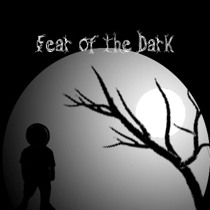

# legacy-lua-fotd
##### _Fear of the Dark_

## About
**Fear of the Dark** is a retro top-down RPG built with Lua and [LOVE2D](https://love2d.org), originally written around 2011. Explore maps, fight mobs, collect items, and talk to NPCs. A spiritual successor to [cellgame](https://github.com/andrewiankidd/legacy-vb-cellgame).

## Features
- Dynamic NPC system — add characters with a folder: script, portrait, sprite
- Map system with collision maps, warps, overlays, and entity placement
- Combat encounters with stats-driven battles
- Item collection and quest objectives (hasitem, goto, talkto)
- Camera panning for maps of any size
- Web build via love.js (WASM)

### Links

    
     
    <strong>Play:</strong>
     
    
    
     
    <strong>Source Code:</strong>
     
    
     
    

## Video

Click to play

## Running locally

    npm run setup      # install npm deps + download LOVE 11.5
    npm start          # launch the game

### Web build

    npm run build      # pack src/ into .love, compile to Web/ via love.js
    npm run serve      # serve Web/ at http://localhost:8080

## Documentation

See the [docs](docs/index.md) for game systems and file structure.

## License

MIT License. See `LICENSE` file for details.
