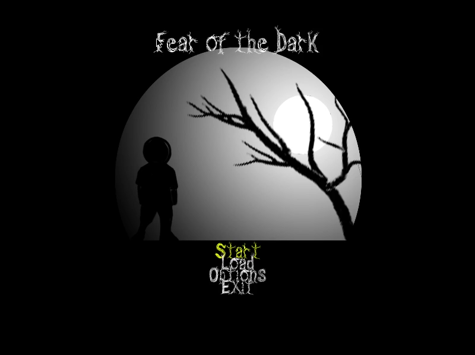

# Fear of the Dark

A game I was working on using Lua + Love2D, 2011ish

a spiritual successor to my previous project [cellgame](https://github.com/andrewiankidd/legacy-vb-cellgame) :)

## Download
Experience the jank for yourself:

[Click to download](https://github.com/andrewiankidd/legacy-lua-fotd/releases/download/release/Fear.of.The.Dark.zip)

## Video

Click to play

## Play in the browser

A web build (LÖVE compiled to WebAssembly via [love.js](https://github.com/Davidobot/love.js)) lives in [`web/`](web/). It needs to be served over HTTP — opening `index.html` over `file://` won't work, browsers block WebAssembly there.

    npm install
    npm run build      # regenerate web/ from the FotD/ folder
    npm run serve      # serve web/ at http://localhost:8080

## Running the desktop version

Install [LÖVE 11.x](https://love2d.org) and point it at the game folder:

    love FotD

The original 2011 build targeted LÖVE 0.7; the code has since been ported to the 11.x API.